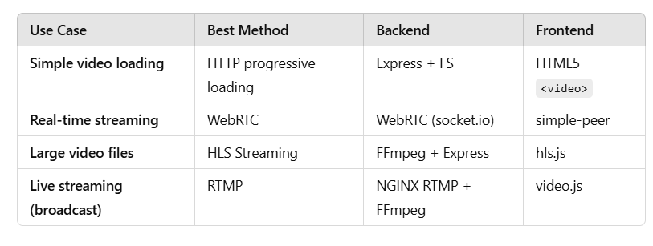
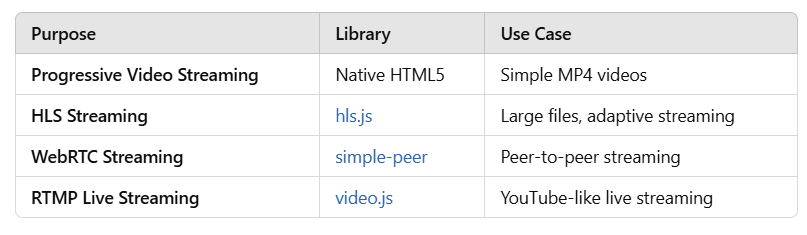

# Video Streaming in React.js

This project provides a guide on how to send videos effectively from the backend to the frontend in a React.js application.

## 📌 Methods for Video Streaming

1. **Progressive Streaming**: Serve videos using simple HTTP servers (e.g., Express, Flask) where the frontend fetches the file progressively.
2. **Adaptive Bitrate Streaming**: Uses HLS (HTTP Live Streaming) or DASH (Dynamic Adaptive Streaming) for smooth playback based on user bandwidth.
3. **WebRTC**: Ideal for real-time video transmission.
4. **RTMP (Real-Time Messaging Protocol)**: Used for live streaming services.

## 🔧 Backend Libraries & Tools

- **Node.js + Express**: Serve video files efficiently.
- **FFmpeg**: Convert videos into streamable formats.
- **Multer**: Handle video uploads.
- **Flask/Django** (for Python-based servers)

## ⚙️ Frontend Libraries & Tools

- **React Player**: Simple video player.
- **Video.js**: Highly customizable player.
- **HLS.js**: Enables HLS playback in browsers.
- **Dash.js**: Supports MPEG-DASH video streaming.

## 🚀 Example Implementation

### Backend (Node.js + Express)
```js
const express = require('express');
const fs = require('fs');
const app = express();

app.get('/video', (req, res) => {
    const path = 'video.mp4';
    const stat = fs.statSync(path);
    const fileSize = stat.size;
    const range = req.headers.range;

    if (range) {
        const parts = range.replace(/bytes=/, "").split("-");
        const start = parseInt(parts[0], 10);
        const end = parts[1] ? parseInt(parts[1], 10) : fileSize - 1;
        const chunksize = end - start + 1;
        const file = fs.createReadStream(path, { start, end });
        const head = {
            'Content-Range': `bytes ${start}-${end}/${fileSize}`,
            'Accept-Ranges': 'bytes',
            'Content-Length': chunksize,
            'Content-Type': 'video/mp4',
        };
        res.writeHead(206, head);
        file.pipe(res);
    } else {
        const head = {
            'Content-Length': fileSize,
            'Content-Type': 'video/mp4',
        };
        res.writeHead(200, head);
        fs.createReadStream(path).pipe(res);
    }
});

app.listen(5000, () => console.log('Server running on port 5000'));
```

### Frontend (React)
```js
import React from 'react';

const VideoPlayer = () => {
    return (
        <video controls width="600">
            <source src="http://localhost:5000/video" type="video/mp4" />
            Your browser does not support the video tag.
        </video>
    );
};

export default VideoPlayer;
```

## 🚀 Streaming Using WebRTC (Real-Time Streaming)
**Use case:** Best for **real-time video streaming** (e.g., video calls, live events).
**Backend:** Use **WebRTC** (via simple-peer or socket.io).
**Frontend:** Use **WebRTC API.**
### Libraries to Use
socket.io - For WebSockets communication
simple-peer - Peer-to-peer WebRTC handling

## 🚀 Streaming Using HLS (HTTP Live Streaming)
**Use case:** Ideal for large videos or live streaming.
**Backend:** Use **FFmpeg** to convert MP4 to HLS (.m3u8 format).
**Frontend:** Use **hls.js** to load the video.

### Backend (FFmpeg + Express.js)
Convert a video to HLS:
```bash
ffmpeg -i sample.mp4 -codec: copy -start_number 0 -hls_time 10 -hls_list_size 0 -f hls output.m3u8
```
Serve the video via Express:

```javascript
import express from "express";
import path from "path";

const app = express();
app.use("/videos", express.static(path.join(__dirname, "videos")));

app.listen(5000, () => console.log("Server running on port 5000"));

```
### Frontend (React + hls.js)
```javascript
import { useEffect, useRef } from "react";
import Hls from "hls.js";

const HLSPlayer = () => {
    const videoRef = useRef(null);

    useEffect(() => {
        if (Hls.isSupported()) {
            const hls = new Hls();
            hls.loadSource("http://localhost:5000/videos/output.m3u8");
            hls.attachMedia(videoRef.current);
        }
    }, []);

    return <video ref={videoRef} controls />;
};

export default HLSPlayer;
```
**Libraries Used:**
hls.js (Frontend)
FFmpeg (Backend for conversion)

## 🚀 Streaming Using RTMP (For Live Streaming)
**Use case:** Best for **broadcasting live streams (e.g., YouTube, Twitch-like platforms).**
**Backend:** Use **NGINX RTMP Module.**
**Frontend:** Use video.js.
### Steps:
Install NGINX with RTMP.
Configure nginx.conf:

**Configure nginx.conf:**
```conf
rtmp {
    server {
        listen 1935;
        chunk_size 4096;

        application live {
            live on;
            record off;
        }
    }
}
```
Use FFmpeg to stream:
```bash
ffmpeg -re -i input.mp4 -c:v libx264 -preset veryfast -b:v 3000k -maxrate 3000k -bufsize 6000k -c:a aac -b:a 128k -f flv rtmp://localhost/live/stream
```
On the frontend, use video.js:
```javascript
import VideoJS from 'video.js';

const LiveStreamPlayer = () => (
    <video-js
        className="video-js"
        controls
        preload="auto"
        data-setup='{ "fluid": true }'
    >
        <source src="rtmp://localhost/live/stream" type="rtmp/flv" />
    </video-js>
);

export default LiveStreamPlayer;
```
**Libraries Used:**

video.js
FFmpeg
NGINX RTMP module

## Summary: Choosing the Best Method
<p align="center">
  
</p>

## Best Libraries for Video Streaming
<p align="center">
  
</p>

## 📌 Third-Party Services
- **Cloudflare Stream** (For scalable video delivery)
- **MUX** (For adaptive streaming)
- **AWS S3 + CloudFront** (For storing and serving videos)
- **Firebase Storage** (For hosting video content)

## ✅ Conclusion

By using appropriate streaming techniques and libraries, we can efficiently deliver videos in a React application while optimizing performance.

---
🚀 **Happy Coding!**
